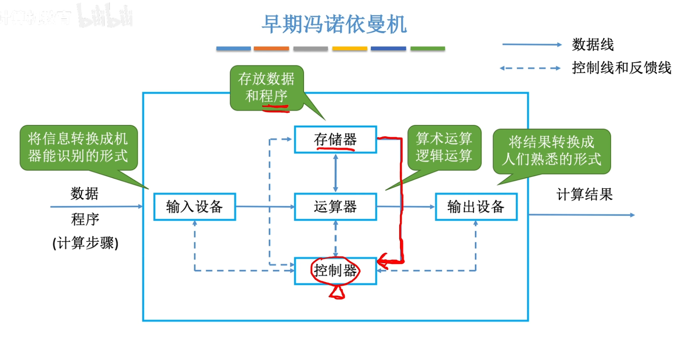

# 第一章 计算机系统概述

## 计算机发展历程

1. 什么是计算机系统

	- 计算机系统 = 硬件 + 软件

	- 硬件 = 计算机的实体 如：主机、外设等

	- 软件 = 由具有各类特殊功能的程序组成 
		- 系统软件——用来管理整个计算机系统 e.g. 操作系统、数据库管理系统(DBMS)、标准程序库、网络软件、语言处理程序、服务程序
		- 应用软件——按任务需要编制成的各种程序 e.g. 抖音、王者荣耀、迅雷、美图秀秀 

2.  硬件的发展

	第一台电子数字计算机：ENIAC(1946)

	​	占地面积170平方米

	​	耗电量150千瓦

	​	运算速度5000次加法/秒

	​	逻辑元件：电子管 （1.8万个）

	| 发展阶段 | 时间      | 逻辑元件                 | 速度（次/秒） | 内存           | 外存                           |
	| -------- | --------- | ------------------------ | ------------- | -------------- | ------------------------------ |
	| 第一代   | 1946-1957 | 电子管                   | 几千-几万     | 汞延迟线、磁鼓 | 穿孔卡片、纸带                 |
	| 第二代   | 1958-1964 | 晶体管                   | 几万-几十万   | 磁芯存储器     | 磁带                           |
	| 第三代   | 1964-1971 | 中小规模集成电路         | 几十万-几百万 | 半导体存储器   | 磁带、磁盘                     |
	| 第四代   | 1972-现在 | 大规模、超大规模集成电路 | 上千万-万亿   | 半导体存储器   | 磁盘、磁带、光盘、半导体存储器 |

	

	微处理器的发展

	| 微处理器    | 机器字长 | 年份 | 晶体管数目 |
	| ----------- | -------- | ---- | ---------- |
	| 8080        | 8位      | 1974 |            |
	| 8086        | 16位     | 1979 | 2.9万      |
	| 80286       | 16位     | 1982 | 13.4万     |
	| 80386       | 32位     | 1985 | 27.5万     |
	| 80486       | 32位     | 1989 | 120.0万    |
	| Pentium     | 64位     | 1993 | 310.0万    |
	| Pentium pro | 64位     | 1995 | 550.0万    |
	| Pentium II  | 64位     | 1997 | 750.0万    |
	| Pentium III | 64位     | 1999 | 950.0万    |
	| Pentium IV  | 64位     | 2000 | 4200.0万   |

	

	1947年，贝尔实验室，发明了”晶体管“

	1955年，肖克利在硅谷创建 肖克利实验室股份有限公司

	1957年，八叛徒（traitorous eight）创立 仙童半导体公司 

	1968年，摩尔等人离开仙童，创立Intel

	1969年，仙童销售部负责人桑德斯离开仙童，创立AMD  

	

	摩尔定律，揭示了信息技术进步的速度

	- 集成电路上可容纳的晶体管数目，约每隔18个月便会增加一倍，整体性能也将提升一倍

	半导体储存器的发展

	- 1970年，仙童公司生产出第一个较大容量的半导体储存器 半导体储存器单芯片容量：1kb, 4kb, 16kb, 64kb, 256kb, 1MB, 4MB, 16MB, 64MB, 256MB, 1GB

3. 软件的发展

	机器语言

	汇编语言

	FORTRAN ——–科学计算  工程计算

	PASCAL

	C++

	java

	DOS

	Windows

	Android

	ios

4. 目前的发展趋势 

	两极分化

	一极是微型计算机向更微型化、网络化、高性能、多用途方向发展；

	一极是巨型机向更巨型化、超高速、并行处理、智能化方向发展。

## 计算机硬件的基本组成

- 早期冯诺依曼机的结构
- 现代计算机的结构

冯诺依曼计算机的特点

1. 计算机由五大部件组成

2. 指令和数据以同等地位存于储存器，可按地址寻访

3. 指令和数据用二进制表示

4. 指令由操作码和地址码组成

5. 存储程序

6. 以运算器为中心

	输入输出设备与储存器之间的数据传送通过运算器完成

现代计算机：==以储存器为中心==

CPU = 运算器 + 控制器

## 各个硬件的工作原理

 

 

## 计算机系统的多级层次结构

## 计算机性能指标

# 数据的表示和运算

