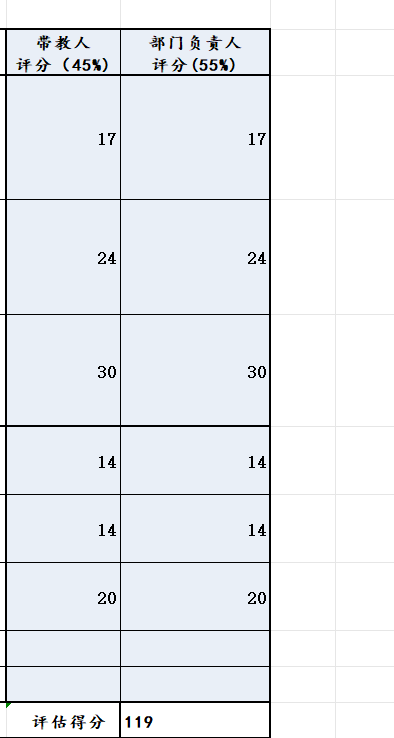

# RUNOOB Markdown Test
## Helllo World!

\#标记标题
\##标记标题

*斜体文本*
前后加*或前后加_

**粗体文本**
前后加两个*或者前后加两个_

***粗斜体***
前后加三个*或者前后加三个_

***
三个*号是分割线

~~两个波浪线是删除线~~
两个波浪线是删除线

<u>带下划线的文本</u>
前加\<u> 后加\</u>

啊手动阀[^要注明的文本]

无序列表
-吃饭
-睡觉
-上班

有序列表
1. 早上
2. 中午
3. 下午
   
列表嵌套
1. 早上
   1. 起床
   2. 出门
2. 中午
   1. 午饭
   2. 午休
   
Markdown区块
> 区块引用
> 菜鸟教程
>>嵌套区块

区块中使用列表
>1. 第一项
>2. 第二项
>- 无序1
>- 无序2

-第一项
 >菜鸟教程

-第二项

`printf()`函数

    print("Hello World")


```python
print()
for i in range(10)：
    print(i)
```


[链接名称](链接地址)
或者
<链接地址>

这是一个链接 [百度](www.baidu.com)
<www.baidu.com>




|第一栏|第二栏|
|:-|:-|
|1|2|


