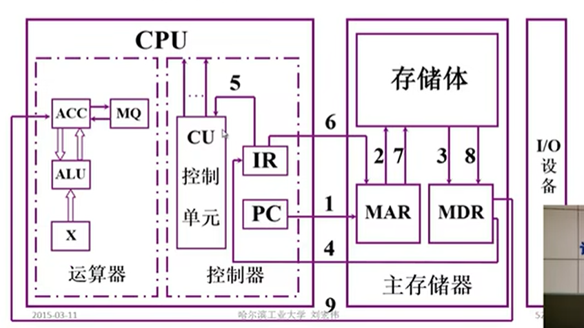
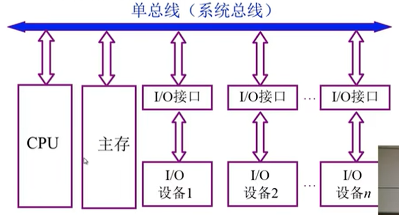
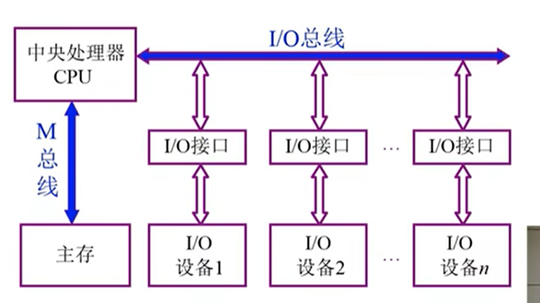
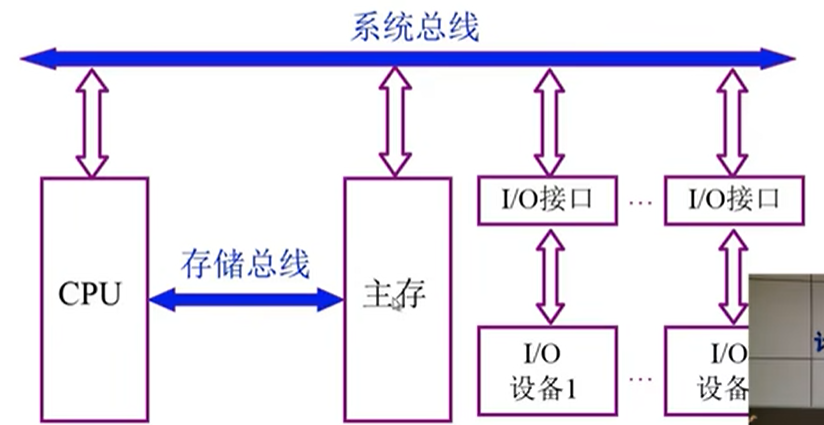
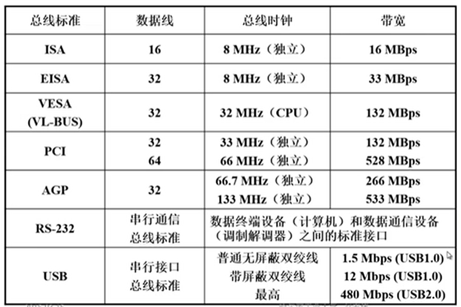

https://www.bilibili.com/video/BV1t4411e7LH/?p=4&spm_id_from=pageDriver&vd_source=15fede687b3c8e571bf980118e321794

# 计算机组成原理
1.  计算机系统简介
    1. 现代计算机的多态性
    2. 计算机的基本组成
       1. 冯诺依曼计算机的特点
          - 计算机由五大部件组成 
            1. 运算器
            2. 控制器
            3. 存储器
            4. 输入设备
            5. 输出设备
          - 指令和数据以同等地位存于储存器，可按地址寻访
          - 指令和数据用二进制表示
          - 指令由操作码和地址码组成
          - 存储程序
          - 以运算器为中心
       2. 现代计算机硬件框图
          - 运算器 ALU  cpu    主机
          - 控制器 CU   cpu    主机
          - 存储器 主存 辅存    主机
          - 输入设备        I/O设备
          - 输出设备        I/O设备

          - 系统复杂性的管理方法-2 3y
            - 层次化
            - 模块化
            - 规则性
        3. 存储器的基本组成
            - 存储体
                - 存储单元 存放一串二进制代码
                - 存储字 存储单元中二进制代码的组合
                - 存储字长 存储单元中二进制代码的位数 每个存储单元赋予一个地址
                - 按地址寻访
            - MAR 
              - 存储器地址寄存器 反应存储单元的个数
            - MDR
              - 存储器数据寄存器 反映存储字长
            - 设MAR = 4位 MDR=8位
              - 存储单元个数 16
              - 存储字长 8 
              - 1111 = 1*2^3 + 1*2^2 + 1*2^1 + 1*2^0 = 8+4+2+1 = 15

        4. 运算器的基本结构和工作过程
            运算器结构

            acc - mq
            alu
            x

            ||ACC|MQ|X|
            |:-|:-|:-|:-|
            |加法|被加数||加数|
            |减法|被减数||减数|
            |乘法|乘积高位|乘数低位|被乘数|
            |除法|被除数 余数|商|除数|

            加法操作过程
            m 是加数地址
            指令  加    M
            初态  acc   被加数被放到ACC 中
                  M   -----  x  把m放到x这个地址中
                  ACC + X ------- ACC  把结果放到acc中

        5. 控制器的基本组成
            - 取指令        PC
            - 分析指令      IR
            - 执行指令      CU

            PC 存放当前欲执行指令的地址， 具有技术功能（PC）+1 --- PC
            IR 存放当前欲执行的指令 
            
        6. 主机完成一条指令的过程
           1. 以取数指令为例
          
   3. 计算机硬件的主要技术指标
      1. 机器字长 CPU一次能处理数据的位数 与CPU中的寄存器位数有关
      2. 运算速度
         1. 主频
         2. 核数，每个核支持的线程数
         3. 吉普森法
         4. CPI 执行一条指令所需时钟周期数
         5. MIPS 每秒执行百万条指令
         6. FLOPS 每秒浮点运算次数
      3. 存储容量
          存放二进制信息的总位数
          - 主存容量
            - 存储单元个数 * 存储字长
            - 如 MAR MDR 容量
            - 10 8 1k*8位
          - 辅存容量
2. 计算机的发展史
    1. 计算机的应用
       1. 科学计算和数据处理
3. 系统总线
   1. 总线的基本概念
      1. 为什么要用总线
      2. 什么是总线
         1. 总线是连接各个部件的信息传输线，是各个部件共享的传输介质
      3. 总线上信息的传送
         1. 串行
         2. 并行
      4. 总线结构的计算机举例
         1. 单总线结构框图
         
         2. 面向CPU的双总线结构框图
          
         3. 以存储器为中心的双总线结构框图
         
      5. 总线的分类
         1. 片内总线 芯片内部的总线
         2. 系统总线 计算机各部件之间的信息传输线
            1. 数据总线 双向 与机器字长、存储字长有关
            2. 地址总线 单项 与存储地址、I/O地址有关
            3. 控制总线 有出 有入
         3. 通信总线 
            1. 用于计算机系统之间或计算机系统与其他系统（如控制仪表，移动通信等）之间的通信
            2. 传输放方式
               1. 串行通信总线
               2. 并行通信总线
   2. 总线特性及性能指标
      1. 总线物理实现
      2. 总线特性
         1. 机械特性    尺寸、形状、管脚数 及 排列顺序
         2. 电气特性    传输方向 和有效的 电平 范围
         3. 功能特性    每根传输线的功能     地址 数据 控制
         4. 时间特性    信号的时序关系
      3. 总线的性能指标
         1. 总线宽度        数据线的根数
         2. 标准传输率      每秒传输的最大字节数（MBps）
         3. 时钟同步/异步   同步、不同步
         4. 总线复用        地址线 与 数据线 复用
         5. 信号线数        地址线、数据线和控制线的总和
         6. 总线控制方式    突发、自动、仲裁、逻辑、计数
         7. 其他指标        负载能力
      4. 总线标准
      
   

